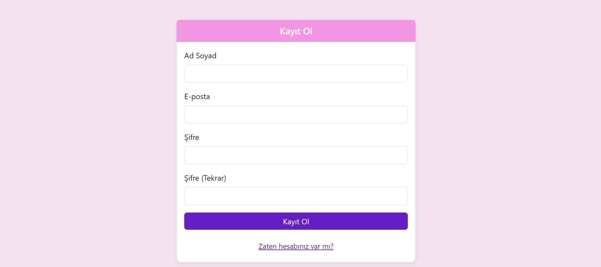
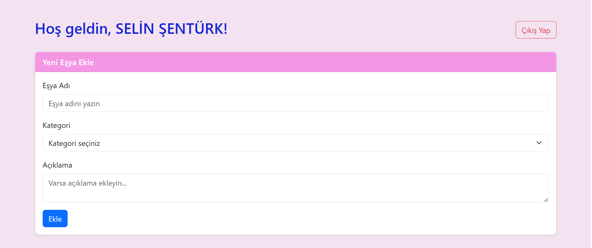
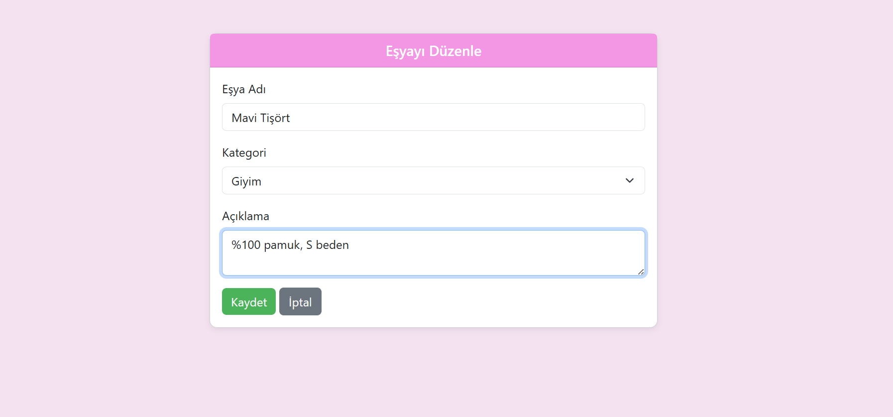

# Kişisel Envanter Takip Sistemi

Bu proje, BTÜ Bilgisayar Mühendisliği Web Tabanlı Programlama dersi kapsamında oluşturulmuştur. Kullanıcıların kişisel eşyalarını kaydedip görüntüleyebileceği basit ve güvenli bir web tabanlı envanter takip sistemidir.

Bu sistem özellikle çok sayıda farklı kategoriye ait eşyası bulunan kullanıcıların, sahip oldukları ürünleri unutmamaları, düzenli tutmaları ve istedikleri zaman erişebilmeleri için tasarlanmıştır. Klasik kağıt kalem yöntemlerinin veya dağınık not alma alışkanlıklarının yerini alacak bu dijital çözüm, kullanıcı dostu arayüzü ve sade tasarımıyla herkesin rahatça kullanabileceği bir yapıya sahiptir.

Proje, PHP programlama dili ve MySQL veritabanı kullanılarak geliştirilmiştir. Arayüz tasarımında ise modern ve mobil uyumlu bir görünüm elde etmek amacıyla Bootstrap 5 kullanılmıştır. Güvenli oturum yönetimi, parola şifreleme ve veritabanı bağlantılarında PDO gibi en iyi uygulama yöntemleri tercih edilmiştir.

## Özellikler

- Kullanıcı kayıt ve giriş sistemi (şifreler güvenli şekilde hash’lenir)
- Giriş yaptıktan sonra kişiye özel panel
- Yeni eşya ekleme, listeleme, düzenleme ve silme
- Bootstrap ile responsive ve sade tasarım
- PHP + MySQL tabanlı yapı

## Kullanılan Teknolojiler

- **PHP** 
- **MySQL**
- **Bootstrap 5**
- **HTML & CSS**
- **PDO**

## Uygulamadan Görüntüler

### Giriş Ekranı

### Kayıt olma Ekranı

### Envanter Paneli

### Yeni Eşya ekle

### Eşya Düzenleme 

## Güvenlik

- Şifreler `password_hash()` ile veritabanına kaydedilir.
- Giriş işlemlerinde `password_verify()` kullanılır.
- Kullanıcı oturumları `$_SESSION` ile kontrol edilir.
- Sayfa erişimleri oturum kontrolü ile sınırlandırılmıştır.
